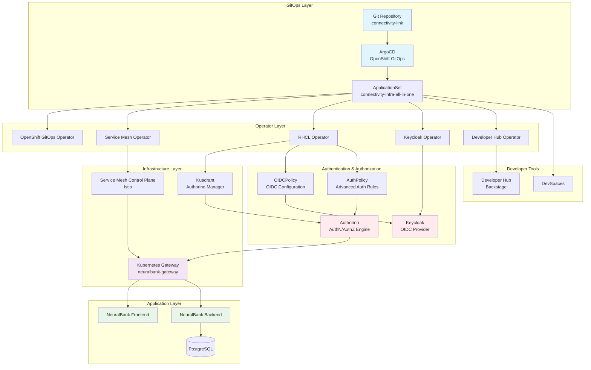
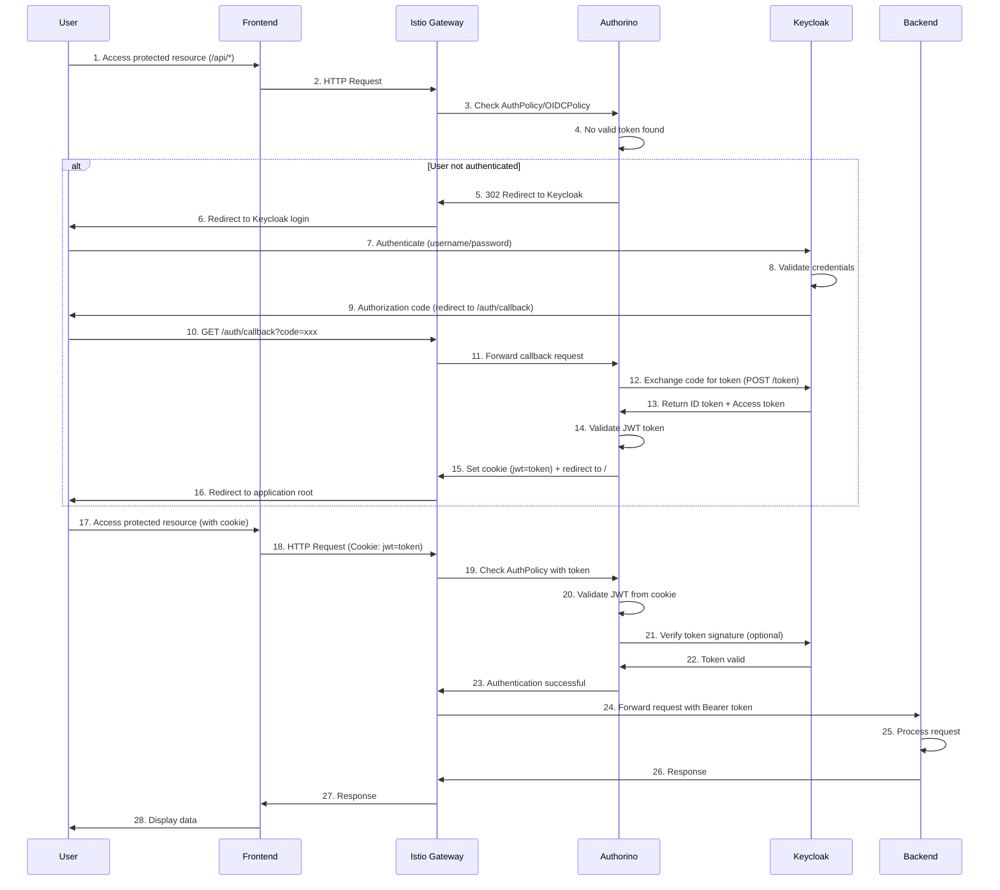
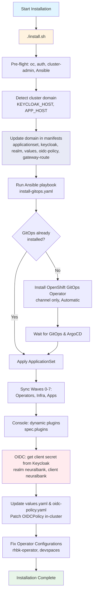

# Security Microservice with Connectivity Link using OpenID Connect (OIDC)

<p align="left">


<a href="https://github.com/maximilianoPizarro/connectivity-link"></a>
<a href="https://www.linkedin.com/in/maximiliano-gregorio-pizarro-consultor-it"></a>
</p>

<div align="center">
  
</div>


## 🚀 Quick Start Recommendation

**For the best experience, we recommend forking this repository to your own GitHub organization or user account.** This allows you to:
- Customize configurations without affecting the original repository
- Set up your own GitOps workflows with ArgoCD pointing to your fork
- Modify cluster-specific settings (like domain names) in your own repository
- Maintain your own version control and deployment pipeline

<div align="center">
  
</div>

After forking, update the repository references in `applicationset-instance.yaml` to point to your fork.

## 📋 TL;DR

- **Requirements**: OpenShift 4.20+, **Python 3.11+**, **OpenShift CLI (`oc`)**, **Ansible Core**, cluster-admin privileges
- **Installation Method**: Automated via `install.sh` (updates cluster domain in all manifests, then runs Ansible playbook)
- **Quick Start**: Run `./install.sh` to install GitOps operator and deploy all applications (or run `ansible-playbook install-gitops.yaml` after updating domain references)
- **Manual Alternative**: Install OpenShift GitOps operator, update cluster domain in manifests, then `oc apply -f applicationset-instance.yaml`
- **Outcome**: ArgoCD (OpenShift GitOps) manages all components; Connectivity Link is enabled via **dynamic console plugin** (Administration → spec.plugins); OIDC client secret is obtained from Keycloak by the playbook

## 📖 Overview

<div align="center">
  
</div>

This repository contains a comprehensive demo of **Connectivity Link** using a GitOps workflow. It demonstrates how applications and infrastructure are declared as Kubernetes/Helm manifests and managed with ArgoCD (OpenShift GitOps). The demo includes:

- **Service Mesh**: Istio-based service mesh for traffic management and security
- **API Gateway**: Kubernetes Gateway API implementation with Istio
- **Authentication**: Keycloak for identity and access management
- **Authorization**: Kuadrant/Authorino (included in RHCL operator) for OIDC-based API protection via OIDCPolicy
- **Application Stack**: NeuralBank demo application (frontend, backend, database)
- **Developer Hub**: Red Hat Developer Hub (Backstage) integration
- **Automated Installation**: Ansible playbook for complete infrastructure provisioning

### Key Components

- **Connectivity Link**: A set of configurations and examples demonstrating connectivity between components (services, gateways, and authentication) within an OpenShift cluster in a GitOps context
- **OpenShift GitOps (ArgoCD)**: Used as the GitOps controller to reconcile the declared state in this repository with the cluster
- **Service Mesh Operator**: Manages the Istio service mesh control plane and data plane
- **RHCL Operator**: Red Hat Connectivity Link operator for managing connectivity policies and OIDC authentication
- **Ansible Automation**: Automated installation playbook that ensures proper operator installation order and verification

### Architecture Overview

The architecture follows a **consolidated ApplicationSet approach** where all infrastructure components, operators, and applications are managed through a single `applicationset-instance.yaml` file. This simplifies deployment and ensures proper installation order through `sync_wave` annotations.

**Installation Order (by sync_wave):**
1. **Wave 0**: OpenShift GitOps operator installation
2. **Wave 1**: Namespaces creation
3. **Wave 2**: Operators (rhbk-operator, RBAC configurations)
4. **Wave 3**: Infrastructure components (Service Mesh, RHCL Operator, Developer Hub)
5. **Wave 4-7**: Applications (NeuralBank Stack, LibreChat, LiteMaaS, etc.)

## ⚙️ Important Requirements

- **OpenShift version**: **4.20+** (this demo and manifests are validated against this version)
- **Python**: **3.11+** (required for Ansible Core and collection dependencies)
- **OpenShift CLI (`oc`)**: Installed and logged in to the target cluster
  ```bash
  oc version
  oc whoami
  ```
- **Ansible**: **Ansible Core** (or `ansible-core`) plus collections `kubernetes.core` and `community.kubernetes` (see [Installation Guide](README-INSTALL.md))
  ```bash
  pip install ansible-core  # Python 3.11+ required
  ansible-galaxy collection install kubernetes.core community.kubernetes
  ```
- **Permissions**: **cluster-admin** privileges are required to:
  - Install the OpenShift GitOps operator
  - Allow the ApplicationSet/instance to create/manage cluster-scoped objects
  - Install and configure service mesh operators
  - Set up RBAC for ArgoCD to manage resources across namespaces

## 🔧 Configuration: Pre-configure DNS with ApplicationSets

**⚠️ Important**: This repository contains demo cluster domain references (`apps.cluster-gpzvq.gpzvq.sandbox670.opentlc.com`) that must be updated to match your OpenShift cluster's base domain before deployment.

Instead of manually updating cluster domain references, you can pre-configure the DNS hostnames directly in the ApplicationSet definitions. This approach uses **Kustomize patches** and **Helm parameters** to dynamically inject your cluster domain values at deployment time.

### Automatic Domain Update

We provide a bash script to automatically replace all cluster domain references:

```bash
chmod +x update-cluster-domain.sh
./update-cluster-domain.sh <your-cluster-base-domain>
```

**Example:**
```bash
./update-cluster-domain.sh apps.your-cluster.example.com
```

The script will:
- Find all YAML files containing the demo cluster domain
- Replace them with your cluster's base domain
- Show a summary of updated files

### Manual Domain Update

If you prefer to update manually, search and replace `apps.cluster-gpzvq.gpzvq.sandbox670.opentlc.com` with your cluster's base domain in the following locations:

- `neuralbank-stack/values.yaml` - Keycloak and application URLs
- `rhcl-operator/` - OIDC policies and route configurations
- `servicemeshoperator3/` - Gateway route hostnames
- `rhbk/` - Keycloak hostname and redirect URIs

### Finding Your Cluster Domain

First, find your OpenShift cluster's base domain:

```bash
oc get ingress.config/cluster -o jsonpath='{.spec.domain}'
```

Or check your cluster's console URL - it typically follows the pattern: `console-openshift-console.apps.<your-cluster-domain>`

### Option 1: ApplicationSet with Kustomize Patches (Recommended)

This approach uses **Kustomize patches** to update DNS hostnames in Keycloak, Routes, and OIDC policies. Update the **`keycloak_host`** and **`app_host`** values in the generator elements:

```yaml
apiVersion: argoproj.io/v1alpha1
kind: ApplicationSet
metadata:
  name: connectivity-infra-plain
  namespace: openshift-gitops
spec:
  goTemplate: true
  generators:
    - list:
        elements:
          - name: namespaces
            namespace: openshift-gitops
            path: namespaces
            sync_wave: "1"
          - name: operators
            namespace: openshift-gitops
            path: operators
            sync_wave: "2"
          - name: developer-hub
            namespace: developer-hub
            path: developer-hub
            sync_wave: "2"
          - name: servicemeshoperator3
            namespace: openshift-operators
            path: servicemeshoperator3
            sync_wave: "3"
          - name: rhcl-operator
            namespace: openshift-operators
            path: rhcl-operator
            sync_wave: "3"
          - name: observability
            namespace: observability
            path: observability
            sync_wave: "5"
  template:
    metadata:
      name: '{{.name}}'
    spec:
      project: default
      source:
        repoURL: 'https://github.com/maximilianoPizarro/connectivity-link.git'
        targetRevision: main
        path: '{{.path}}'
      destination:
        server: 'https://kubernetes.default.svc'
        namespace: '{{.namespace}}'
      syncPolicy:
        automated:
          selfHeal: true
          prune: true
        syncOptions:
          - CreateNamespace=true
---
apiVersion: argoproj.io/v1alpha1
kind: ApplicationSet
metadata:
  name: connectivity-infra-rhbk
  namespace: openshift-gitops
spec:
  goTemplate: true
  generators:
    - list:
        elements:
          - name: rhbk
            namespace: rhbk-operator
            path: rhbk
            sync_wave: "2"
            keycloak_host: rhbk.apps.cluster-24p6f.24p6f.sandbox2386.opentlc.com
            app_host: neuralbank.apps.cluster-24p6f.24p6f.sandbox2386.opentlc.com
  template:
    metadata:
      name: '{{.name}}'
    spec:
      project: default
      source:
        repoURL: 'https://github.com/maximilianoPizarro/connectivity-link.git'
        targetRevision: main
        path: '{{.path}}'
        kustomize:
          patches:
          - target:
              group: k8s.keycloak.org
              kind: Keycloak
              name: rhbk
            patch: |-
              - op: replace
                path: /spec/hostname/hostname
                value: "{{.keycloak_host}}"
          - target:
              group: k8s.keycloak.org
              kind: KeycloakRealmImport
              name: neuralbank-full-import
            patch: |-
              - op: replace
                path: /spec/realm/clients/0/redirectUris/0
                value: "https://{{.app_host}}/*"
          - target:
              group: route.openshift.io
              kind: Route
              name: neuralbank-external-route
            patch: |-
              - op: replace
                path: /spec/host
                value: "{{.app_host}}"
          - target:
              group: extensions.kuadrant.io
              kind: OIDCPolicy
              name: neuralbank-oidc
            patch: |-
              - op: replace
                path: /spec/provider/issuerURL
                value: "https://{{.keycloak_host}}/realms/neuralbank"
              - op: replace
                path: /spec/provider/authorizationEndpoint
                value: "https://{{.keycloak_host}}/realms/neuralbank/protocol/openid-connect/auth"
              - op: replace
                path: /spec/provider/tokenEndpoint
                value: "https://{{.keycloak_host}}/realms/neuralbank/protocol/openid-connect/token"
              - op: replace
                path: /spec/provider/redirectURI
                value: "https://{{.app_host}}/auth/callback"
      destination:
        server: 'https://kubernetes.default.svc'
        namespace: '{{.namespace}}'
      syncPolicy:
        automated:
          selfHeal: true
          prune: true
        syncOptions:
          - CreateNamespace=true
```

**Key Configuration Points:**
- **`keycloak_host`**: Update this value with your Keycloak hostname (e.g., `rhbk.apps.<your-cluster-domain>`)
- **`app_host`**: Update this value with your application hostname (e.g., `neuralbank.apps.<your-cluster-domain>`)
- The Kustomize patches automatically update all DNS references in Keycloak, Routes, and OIDC policies

### Option 2: ApplicationSet with Helm Parameters

For Helm-based deployments, use **Helm parameters** to inject DNS values. Update the **`keycloak_host`** and **`app_host`** values in the generator:

```yaml
apiVersion: argoproj.io/v1alpha1
kind: ApplicationSet
metadata:
  name: connectivity-apps-helm-internal
  namespace: openshift-gitops
spec:
  goTemplate: true
  generators:
    - list:
        elements:
          - name: neuralbank-stack
            namespace: neuralbank-stack
            path: neuralbank-stack
            sync_wave: "5"
            keycloak_host: rhbk.apps.cluster-24p6f.24p6f.sandbox2386.opentlc.com
            app_host: neuralbank.apps.cluster-24p6f.24p6f.sandbox2386.opentlc.com
  template:
    metadata:
      name: '{{.name}}'
    spec:
      project: default
      source:
        repoURL: 'https://github.com/maximilianoPizarro/connectivity-link.git'
        targetRevision: main
        path: '{{.path}}'
        helm:
          parameters:
            - name: "keycloak.issuerUrl"
              value: "https://{{.keycloak_host}}/realms/neuralbank"
            - name: "keycloak.redirectUri"
              value: "https://{{.app_host}}/auth/callback"
            - name: "keycloak.authorizationEndpoint"
              value: "https://{{.keycloak_host}}/realms/neuralbank/protocol/openid-connect/auth"
            - name: "keycloak.tokenEndpoint"
              value: "https://{{.keycloak_host}}/realms/neuralbank/protocol/openid-connect/token"
            - name: "keycloak.postLogoutRedirectUri"
              value: "https://{{.app_host}}"
      destination:
        server: 'https://kubernetes.default.svc'
        namespace: '{{.namespace}}'
      syncPolicy:
        automated:
          selfHeal: true
          prune: true
        syncOptions:
          - CreateNamespace=true
```

**Key Configuration Points:**
- **`keycloak_host`**: Update this value with your Keycloak hostname
- **`app_host`**: Update this value with your application hostname
- Helm parameters automatically inject DNS values into the Helm chart values

### Option 3: External Helm Chart ApplicationSet

For external Helm charts, configure the chart repository and version:

```yaml
apiVersion: argoproj.io/v1alpha1
kind: ApplicationSet
metadata:
  name: connectivity-apps-helm-external
  namespace: openshift-gitops
spec:
  goTemplate: true
  generators:
    - list:
        elements:
          - name: workshop-pipelines
            namespace: workshop-pipelines
            helmRepoURL: 'https://maximilianopizarro.github.io/workshop-pipelines/'
            chart: workshop-pipelines
            chartVersion: "0.1.6"
            sync_wave: "5"
  template:
    metadata:
      name: '{{.name}}'
    spec:
      project: default
      source:
        repoURL: '{{.helmRepoURL}}'
        targetRevision: '{{.chartVersion}}'
        chart: '{{.chart}}'
      destination:
        server: 'https://kubernetes.default.svc'
        namespace: '{{.namespace}}'
      syncPolicy:
        automated:
          selfHeal: true
          prune: true
        syncOptions:
          - CreateNamespace=true
```

### Benefits of Pre-configuring DNS

- **No manual file editing**: DNS values are configured once in the ApplicationSet
- **GitOps-friendly**: All configuration is version-controlled in the ApplicationSet manifests
- **Dynamic updates**: Change DNS values by updating the ApplicationSet and ArgoCD will sync automatically
- **Environment-specific**: Use different ApplicationSets for different environments (dev, staging, prod)

## 🚀 Getting Started

### Automated Installation (Recommended)

The recommended way to install Connectivity Link is using the **`install.sh`** script, which updates all cluster domain references and then runs the Ansible playbook.

**Prerequisites:**
- **Python 3.11+** (required for Ansible Core)
- **OpenShift CLI (`oc`)** installed and authenticated with cluster-admin
- **Ansible Core** and collections (see [README-INSTALL.md](README-INSTALL.md)):
  ```bash
  pip install -r requirements.txt   # Python 3.11+
  ansible-galaxy collection install kubernetes.core community.kubernetes
  ```

**Run the installation:**
```bash
chmod +x install.sh
./install.sh
```

**What `install.sh` does:**
1. **Pre-flight**: Checks `oc`, authentication, cluster-admin, Ansible
2. **Cluster domain**: Detects cluster domain and sets Keycloak/app hosts
3. **Domain update**: Replaces domain references in:
   - `applicationset-instance.yaml`
   - `rhbk/keycloak.yaml`
   - `rhbk/keycloak-neuralbank-realm.yaml`
   - `neuralbank-stack/values.yaml`
   - `rhcl-operator/oidc-policy.yaml`
   - `servicemeshoperator3/gateway-route.yaml`
4. **Ansible playbook**: Runs `install-gitops.yaml` to install GitOps and deploy components

**What the Ansible playbook does:**
1. **Skips if GitOps already installed**: Detects existing ArgoCD instance and skips operator installation when already available
2. **Installs OpenShift GitOps Operator** (channel-based, no version pin)
   - Creates/updates Subscription with `installPlanApproval: Automatic` and channel only (no `startingCSV`)
   - Waits for InstallPlan and CSV; fallback to other channels if needed
   - Verifies ArgoCD CRD and instance
3. **Applies ApplicationSet**: Applies `applicationset-instance.yaml` to deploy all components; waits for operators and applications
4. **Console**: Enables **dynamic console plugins** (GitOps and Connectivity Link) via `spec.plugins` (Administration → Cluster Settings → Console)
5. **OIDC**: When Keycloak and realm `neuralbank` are ready, obtains the client secret for client `neuralbank` from Keycloak and updates `neuralbank-stack/values.yaml`, `rhcl-operator/oidc-policy.yaml`, and patches the OIDCPolicy in-cluster
6. **Operator fixes**: Fixes `rhbk-operator` OperatorGroup; cleans up duplicate `devspaces` subscriptions

See [README-INSTALL.md](README-INSTALL.md) for detailed prerequisites and troubleshooting.

### Manual Installation (Alternative)

If you prefer to install manually:

### Step 1: Install OpenShift GitOps Operator

<div align="center">
  
</div>

Install the OpenShift GitOps Operator (via OperatorHub in the OpenShift console or via OLM). This is the only manual step required before applying the manifests in this demo.

- **Console method**: Operators → OperatorHub → search for "OpenShift GitOps" → Install
- **CLI alternative**: Use `oc` to install the operator with OLM if you have an appropriate catalog/package available

### Step 2: Configure DNS in ApplicationSets (Required)

Before proceeding, **pre-configure your cluster domain** in the ApplicationSet definitions as described in the [Configuration](#-configuration-pre-configure-dns-with-applicationsets) section above. Update the **`keycloak_host`** and **`app_host`** values in the ApplicationSet generators to match your OpenShift cluster domain.

### Step 3: Create ApplicationSet Instance

Create the ApplicationSet / ArgoCD instance using the top-level manifest:

**Option 1: Apply via ArgoCD UI (Recommended)**
1. Open the OpenShift GitOps (ArgoCD) console
2. Go to Settings > Repositories and ensure this repository is added
3. Create a new Application pointing to this repository and the `applicationset-instance.yaml` file
4. ArgoCD will process the ApplicationSet and create all applications

**Option 2: Apply via kubectl (if YAML validation passes)**
```bash
oc apply -f applicationset-instance.yaml
```

**Note:** If you encounter YAML parsing errors, it's because the ApplicationSet uses Go templates (`{{- if eq .app_type "rbac"}}`) which are processed by ArgoCD, not by Kubernetes. In this case, use Option 1 (ArgoCD UI) or apply the ApplicationSet as an ArgoCD Application.

- `applicationset-instance.yaml` creates/instantiates the applications defined in this repo and points them to this repository for ArgoCD to reconcile
- After applying, open the OpenShift GitOps (ArgoCD) console to view status and sync applications if needed

<div align="center">
  
</div>


### Step 4: Keycloak and OIDC Client (Automated or Manual)

If you use **`install.sh`** and the Ansible playbook, the realm `neuralbank` is imported with clients `neuralbank-frontend`, `neuralbank-backend`, and **`neuralbank`** (confidential, for OIDCPolicy). Once Keycloak is ready, the playbook **obtains the client secret** from Keycloak and updates `neuralbank-stack/values.yaml`, `rhcl-operator/oidc-policy.yaml`, and patches the OIDCPolicy in-cluster. Commit and push the updated files so ArgoCD syncs.

**If installing manually**, after Keycloak is deployed and the realm is imported, configure the client in the Keycloak console:

**Access Keycloak Console:**
1. Navigate to the Keycloak route in OpenShift (typically `rhbk.apps.<your-cluster-domain>`)
2. Log in with the admin credentials (configured in `rhbk/keycloak-initial-admin.yaml`)
3. Select the `neuralbank` realm

**Configure Client Settings:**

For the `neuralbank` client (or `neuralbank-frontend` if using that client):

1. **Navigate to Clients** → Select your client (e.g., `neuralbank`)
2. **Enable Client Authentication:**
   - Set **Client authentication** to **ON** (this makes it a confidential client)
   - Ensure `publicClient` is set to `false` in the configuration
3. **Enable Direct Access Grants:**
   - Enable **Direct access grants** (allows Resource Owner Password Credentials grant type)
4. **Configure PKCE:**
   - Set **Proof Key for Code Exchange Code Challenge Method** to **S256**
   - This enables PKCE (RFC 7636) for enhanced security in authorization code flows

**Generate Client Secret:**

After enabling client authentication, you need to generate and retrieve the client secret:

1. Go to the **Credentials** tab of your client
2. Copy the **Client secret** value
3. Update the `clientSecret` field in [`rhcl-operator/oidc-policy.yaml`](rhcl-operator/oidc-policy.yaml) with this value
4. Commit and push the change to your repository for ArgoCD to sync

**Note:** The client secret is required for the OIDC Policy to authenticate with Keycloak. Without it, the OIDC authentication flow will fail.

### Step 5: Create OpenShift Route for Gateway (Manual)

The Gateway API Gateway resource (`neuralbank-gateway`) needs an OpenShift Route to expose it externally. This step must be done manually from the OpenShift console or CLI.

**Option 1: Using OpenShift Console**

1. Navigate to **Networking** → **Routes** in the `istio-system` namespace
2. Click **Create Route**
3. Configure the route:
   - **Name**: `neuralbank-external-route` (or your preferred name)
   - **Hostname**: `neuralbank.apps.<your-cluster-domain>` (or use a wildcard `*.apps.<your-cluster-domain>`)
   - **Service**: Select `neuralbank-gateway-istio` service
   - **Target Port**: Select `http` (port 8080)
   - **TLS Termination**: **Edge**
   - **Insecure Traffic**: **Redirect**

**Option 2: Using CLI**

You can also create the route using `oc`:

```bash
oc create route edge neuralbank-external-route \
  --service=neuralbank-gateway-istio \
  --hostname=neuralbank.apps.<your-cluster-domain> \
  --port=http \
  --namespace=istio-system
```

**For Wildcard Route:**

If you want to use a wildcard route to access both frontend and backend through the same hostname:

```bash
oc create route edge neuralbank-external-route \
  --service=neuralbank-gateway-istio \
  --hostname="*.apps.<your-cluster-domain>" \
  --port=http \
  --namespace=istio-system
```

**Note:** The wildcard route allows you to access the application using any subdomain under `apps.<your-cluster-domain>`, which is useful for development and testing. The Gateway and HTTPRoute resources will handle the actual routing based on the `hostnames` specified in the HTTPRoute manifests.

## 📁 Repository Structure

### Top-Level Files

- [`applicationset-instance.yaml`](applicationset-instance.yaml) — ArgoCD ApplicationSet/instance manifest that ties multiple applications together
- [`update-cluster-domain.sh`](update-cluster-domain.sh) — Bash script to automatically update cluster domain references (legacy method; **recommended**: use ApplicationSets with Kustomize patches as described in [Configuration](#-configuration-pre-configure-dns-with-applicationsets))
- [`uninstall-applicationset.sh`](uninstall-applicationset.sh) — Bash script to gracefully uninstall all applications and operators

### Developer Hub (`developer-hub/`)

Red Hat Developer Hub (Backstage) configuration and manifests:

- [`developer-hub/README.md`](developer-hub/README.md) — Developer Hub app configuration and notes
- [`developer-hub/app-config.yaml`](developer-hub/app-config.yaml) — Backstage application configuration
- [`developer-hub/backstage.yaml`](developer-hub/backstage.yaml) — Backstage Kubernetes deployment manifest
- [`developer-hub/dynamic-plugins.yaml`](developer-hub/dynamic-plugins.yaml) — Dynamic plugin configuration
- [`developer-hub/kustomization.yaml`](developer-hub/kustomization.yaml) — Kustomize overlay for developer-hub
- [`developer-hub/ols-embeddings.yaml`](developer-hub/ols-embeddings.yaml) — Embeddings/ML integration configuration
- [`developer-hub/rcsconfig-onprem.yaml`](developer-hub/rcsconfig-onprem.yaml) — RCS on-premises configuration
- [`developer-hub/rcsconfig.yaml`](developer-hub/rcsconfig.yaml) — RCS cloud configuration
- [`developer-hub/rhdh-rbac-policy.yaml`](developer-hub/rhdh-rbac-policy.yaml) — RBAC policy for Developer Hub
- [`developer-hub/rolebinding.yaml`](developer-hub/rolebinding.yaml) — RoleBinding for the app namespace
- [`developer-hub/secret-secrets-rhdh.yaml`](developer-hub/secret-secrets-rhdh.yaml) — Secrets manifest for Developer Hub

### NeuralBank Stack (`neuralbank-stack/`)

Helm chart for the NeuralBank demo application (frontend, backend, database, and proxy):

- [`neuralbank-stack/Chart.yaml`](neuralbank-stack/Chart.yaml) — Helm chart metadata
- [`neuralbank-stack/values.yaml`](neuralbank-stack/values.yaml) — Helm chart default values (includes Keycloak and API configuration)
- [`neuralbank-stack/templates/`](neuralbank-stack/templates/) — Kubernetes manifest templates:
  - `backend.yaml` — Backend service deployment
  - `db-deployment.yaml` — PostgreSQL database deployment
  - `db-resources.yaml` — Database persistent volume and service
  - `frontend.yaml` — Frontend application deployment
  - `neuralbank-config.yaml` — ConfigMap with runtime configuration (Keycloak URLs, API endpoints)
  - `proxy.yaml` — Nginx reverse proxy/gateway configuration
  - `route.yaml` — OpenShift Route for external access
  - `sa-default.yaml` — Service account definitions
  - `rolebinding.yaml` — RBAC bindings
  - `scc-rolebinding.yaml` — Security context constraints

### Operators (`operators/`)

Helm charts for operators used in the demo:

- [`operators/Chart.yaml`](operators/Chart.yaml) — Helm chart metadata
- [`operators/helm-values.yaml`](operators/helm-values.yaml) — Operator configuration values
- [`operators/templates/`](operators/templates/) — Operator subscription and configuration manifests:
  - `rhbk.yaml` — Red Hat Build of Keycloak operator subscription
  - `rhcl-operator.yaml` — Red Hat Connectivity Link operator subscription
  - `rhdh.yaml` — Red Hat Developer Hub operator subscription
  - `servicemeshoperator3.yaml` — Service Mesh Operator (Istio) subscription
  - Cluster Observability Operator (via `helm-values.yaml` subscriptions)
  - `subscriptions.yaml` — Operator subscription definitions
- [`operators/tests/`](operators/tests/) — Helm chart tests

### Red Hat Build of Keycloak (`rhbk/`)

Keycloak and related secrets/realm setup used for authentication in the demo:

- [`rhbk/keycloak-backstage-realm.yaml`](rhbk/keycloak-backstage-realm.yaml) — Backstage realm configuration for Keycloak
- [`rhbk/keycloak-db-secret.yaml`](rhbk/keycloak-db-secret.yaml) — Database credentials secret for Keycloak
- [`rhbk/keycloak-initial-admin.yaml`](rhbk/keycloak-initial-admin.yaml) — Initial admin credentials for Keycloak
- [`rhbk/keycloak.yaml`](rhbk/keycloak.yaml) — Keycloak operator CR that deploys Keycloak (demo configuration)
- [`rhbk/postgres.yaml`](rhbk/postgres.yaml) — PostgreSQL database for Keycloak
- [`rhbk/kustomization.yaml`](rhbk/kustomization.yaml) — Kustomize configuration
- [`rhbk/rolebinding.yaml`](rhbk/rolebinding.yaml) — RBAC bindings for Keycloak namespace

### RHCL Operator (`rhcl-operator/`)

Red Hat Connectivity Link (RHCL) operator configurations for API gateway, OIDC authentication, and authorization policies. **Kuadrant/Authorino is included in the RHCL operator** — you do not install a separate Kuadrant operator; RHCL deploys the Kuadrant controller in the `kuadrant-system` namespace.

- [`rhcl-operator/kustomization.yaml`](rhcl-operator/kustomization.yaml) — Kustomize configuration for RHCL resources
- [`rhcl-operator/kuadrant.yaml`](rhcl-operator/kuadrant.yaml) — Kuadrant CR (manages Authorino for OIDC authentication)
- [`rhcl-operator/oidc-policy.yaml`](rhcl-operator/oidc-policy.yaml) — OIDCPolicy CR defining OIDC authentication flow (issuer, client credentials, endpoints)
- [`rhcl-operator/neuralbank-route.yaml`](rhcl-operator/neuralbank-route.yaml) — Kubernetes Gateway API HTTPRoute resources:
  - `neuralbank-api-route` — Routes `/api` and `/q` paths to backend service
  - `neuralbank-root-route` — Routes root path and static assets to frontend service
- [`rhcl-operator/neuralbank-oidc-callback.yaml`](rhcl-operator/neuralbank-oidc-callback.yaml) — HTTPRoute for OIDC callback endpoint (`/auth/callback`)
- [`rhcl-operator/keycloak-authpolicy.yaml`](rhcl-operator/keycloak-authpolicy.yaml) — AuthPolicy CR for advanced authentication rules and token handling
- [`rhcl-operator/rolebinding.yaml`](rhcl-operator/rolebinding.yaml) — RBAC bindings for ArgoCD to manage RHCL resources

**Key Features:**
- OIDC-based authentication using Keycloak as the identity provider
- API protection with Authorino (via Kuadrant)
- Gateway API HTTPRoute definitions for traffic routing
- Token-based authorization with cookie and header support

#### HTTPRoute Resources

The HTTPRoute resources define how traffic is routed from the Gateway to backend services. These routes use the Kubernetes Gateway API standard and are managed by the Istio Gateway implementation.

**Structure:**
- **`parentRefs`**: References the Gateway resource (`neuralbank-gateway` in `istio-system` namespace) that will handle the traffic
- **`hostnames`**: Specifies the hostname(s) that this route will match (must match the OpenShift Route hostname)
- **`rules`**: Defines path-based routing rules:
  - **`matches`**: Path patterns to match (e.g., `/api`, `/q`, `/`)
  - **`backendRefs`**: Kubernetes Service to route matched traffic to

**Example HTTPRoute (`neuralbank-api-route`):**
```yaml
spec:
  parentRefs:
    - name: neuralbank-gateway
      namespace: istio-system
  hostnames:
    - "neuralbank.apps.<your-cluster-domain>"
  rules:
    - matches:
        - path:
            type: PathPrefix
            value: /api
      backendRefs:
        - name: neuralbank-backend-svc
          port: 8080
```

This route matches requests to `/api/*` and `/q/*` and forwards them to the `neuralbank-backend-svc` service on port 8080.

#### OIDC Policy Configuration

The OIDCPolicy resource configures OIDC authentication for protected routes. It integrates with Authorino (via Kuadrant) to enforce authentication at the gateway level.

**Key Configuration Fields:**

1. **`provider.issuerURL`**: The Keycloak realm issuer URL
   - Format: `https://<keycloak-host>/realms/<realm-name>`
   - Example: `https://rhbk.apps.<your-cluster-domain>/realms/neuralbank`

2. **`provider.clientID`**: The Keycloak client ID (must match the client configured in Keycloak)
   - Example: `neuralbank`

3. **`provider.clientSecret`**: **⚠️ IMPORTANT** — The client secret generated from Keycloak console
   - This must be obtained from Keycloak after enabling client authentication
   - Steps to get the secret:
     1. Log into Keycloak console
     2. Navigate to your realm → Clients → Select your client
     3. Go to the **Credentials** tab
     4. Copy the **Client secret** value
     5. Update the `clientSecret` field in `oidc-policy.yaml`
   - **Security Note**: Consider using a Kubernetes Secret to store the client secret instead of hardcoding it in the YAML file

4. **`provider.authorizationEndpoint`**: Keycloak authorization endpoint
   - Format: `https://<keycloak-host>/realms/<realm-name>/protocol/openid-connect/auth`

5. **`provider.redirectURI`**: OAuth callback URL (must match a redirect URI configured in Keycloak client)
   - Example: `https://neuralbank.apps.<your-cluster-domain>/auth/callback`

6. **`provider.tokenEndpoint`**: Keycloak token endpoint
   - Format: `https://<keycloak-host>/realms/<realm-name>/protocol/openid-connect/token`

7. **`targetRef`**: References the HTTPRoute resource that should be protected by this OIDC policy
   - Example: `neuralbank-api-route` (protects the `/api` and `/q` endpoints)

8. **`auth.tokenSource`**: Defines where to look for the authentication token
   - **`authorizationHeader`**: Token in `Authorization: Bearer <token>` header
   - **`cookie`**: Token stored in a cookie (e.g., `jwt` cookie)

**Example OIDC Policy:**
```yaml
spec:
  provider:
    issuerURL: "https://rhbk.apps.<your-cluster-domain>/realms/neuralbank"
    clientID: neuralbank
    clientSecret: "<your-client-secret-from-keycloak>"  # ⚠️ Update this!
    authorizationEndpoint: "https://rhbk.apps.<your-cluster-domain>/realms/neuralbank/protocol/openid-connect/auth"
    redirectURI: "https://neuralbank.apps.<your-cluster-domain>/auth/callback"
    tokenEndpoint: "https://rhbk.apps.<your-cluster-domain>/realms/neuralbank/protocol/openid-connect/token"
  targetRef:
    group: gateway.networking.k8s.io
    kind: HTTPRoute
    name: neuralbank-api-route
  auth:
    tokenSource:
      authorizationHeader:
        prefix: Bearer
        name: Authorization
      cookie:
        name: jwt
```

**Important Notes:**
- The `clientSecret` must be updated after generating it from the Keycloak console (see [Step 4](#step-4-configure-keycloak-client-settings-manual))
- The `redirectURI` must exactly match one of the redirect URIs configured in the Keycloak client
- The `hostnames` in HTTPRoute resources must match the hostname used in the OpenShift Route
- All URLs (issuer, endpoints) must use HTTPS and match your cluster's domain configuration

### Service Mesh Operator 3 (`servicemeshoperator3/`)

Service Mesh Operator (Istio) configurations for service mesh control plane and gateway:

- [`servicemeshoperator3/kustomization.yaml`](servicemeshoperator3/kustomization.yaml) — Kustomize configuration for service mesh resources
- [`servicemeshoperator3/smcp-controlplane.yaml`](servicemeshoperator3/smcp-controlplane.yaml) — Service Mesh Control Plane (SMCP) configuration:
  - `Istio` CR — Istio control plane deployment (version v1.27.3)
  - `IstioCNI` CR — Istio CNI plugin configuration
  - ClusterRole/ClusterRoleBinding — RBAC for ArgoCD to manage Istio resources
- [`servicemeshoperator3/gateway.yaml`](servicemeshoperator3/gateway.yaml) — Kubernetes Gateway API Gateway resource:
  - `neuralbank-gateway` — Gateway with HTTP (8080) and HTTPS (443) listeners
  - Role/RoleBinding — RBAC for ArgoCD to manage Gateway resources in istio-system namespace
- [`servicemeshoperator3/gateway-route.yaml`](servicemeshoperator3/gateway-route.yaml) — Example HTTPRoute for gateway (commented out by default)

**Key Features:**
- Istio service mesh control plane management
- Kubernetes Gateway API implementation
- Multi-protocol support (HTTP/HTTPS)
- Cross-namespace route support

### Observability (`observability/`)

Metrics and monitoring via the **Red Hat OpenShift Cluster Observability Operator (COO)**:

- [`observability/namespace.yaml`](observability/namespace.yaml) — Namespace for the monitoring stack
- [`observability/monitoring-stack.yaml`](observability/monitoring-stack.yaml) — `MonitoringStack` CR that deploys Prometheus (7-day retention) in the `observability` namespace
- [`observability/kustomization.yaml`](observability/kustomization.yaml) — Kustomize configuration

**Prerequisites:** The Cluster Observability Operator must be installed (included in `operators` Helm values; operator runs in `openshift-cluster-observability-operator`). The **observability** application syncs after operators (sync_wave: 5).

**Usage:** After syncing, the COO creates Prometheus and related resources in `observability`. You can add Grafana (e.g. via Grafana Operator) and use the Prometheus service as a data source for dashboards.

### Namespaces (`namespaces/`)

- [`namespaces/namespaces.yaml`](namespaces/namespaces.yaml) — Kubernetes namespace definitions for the demo

### Workshop Pipelines (`workshop-pipelines/`)

Helm-based deployment configuration for the workshop-pipelines chart from an external Helm repository:

- [`workshop-pipelines/values.yaml`](workshop-pipelines/values.yaml) — Custom values file for the workshop-pipelines Helm chart
- [`workshop-pipelines/README.md`](workshop-pipelines/README.md) — Documentation for the workshop-pipelines deployment

**Key Features:**
- Deployed from external Helm repository: `https://maximilianopizarro.github.io/workshop-pipelines/`
- Customizable via `values.yaml` in this repository
- Managed by ArgoCD through ApplicationSet with sync_wave: 4

## 📝 Notes

- The demo configuration uses a Keycloak operator CR ([`rhbk/keycloak.yaml`](rhbk/keycloak.yaml)) to bootstrap an instance and wire it to a PostgreSQL database
- Everything in this repository is intended to be applied via a GitOps controller (ArgoCD), so changes to these files represent the desired cluster state
- The service mesh and gateway configurations work together to provide:
  - Traffic management and routing
  - mTLS between services
  - OIDC authentication at the gateway level
  - API protection with fine-grained authorization policies

## 🏗️ Architecture Diagrams

### System Architecture

The following diagram illustrates the complete system architecture, showing how all components interact:



### OIDC Authentication Flow

The following sequence diagram illustrates the complete OIDC authentication flow using Keycloak and Authorino:



### Installation Flow

The following diagram shows the automated installation process (recommended: `install.sh`; alternative: run playbook after updating domains):



### The Application Solution without Auth 🙌:

<div align="center">
  
</div>

### The Application Solution with Auth 🔐 powered by Red Hat Build of Keycloak & Authorino:

<div align="center">
  
</div>

## 🗑️ Uninstallation

To gracefully uninstall all applications and operators generated by the ApplicationSet, use the provided uninstallation script:

```bash
chmod +x uninstall-applicationset.sh
./uninstall-applicationset.sh
```

### Uninstallation Options

The script provides several options for different uninstallation scenarios:

**Dry-run mode** (preview what would be deleted without making changes):
```bash
./uninstall-applicationset.sh --dry-run
```

**Force mode** (skip confirmation prompts):
```bash
./uninstall-applicationset.sh --force
```

**Complete cleanup** (also removes operator subscriptions and namespaces):
```bash
./uninstall-applicationset.sh --clean-all
```

**Combined options**:
```bash
./uninstall-applicationset.sh --force --clean-all
```

### What the Script Does

The uninstallation script performs the following operations in reverse order of installation (sync_wave 5 → 1):

1. **Removes ArgoCD Applications** in reverse sync order:
   - `neuralbank-stack` (sync_wave: 5)
   - `workshop-pipelines` (sync_wave: 4)
   - `servicemeshoperator3` and `rhcl-operator` (sync_wave: 3)
   - `developer-hub`, `rhbk`, and `operators` (sync_wave: 2)
   - `namespaces` (sync_wave: 1)

2. **Removes the ApplicationSet** instance

3. **Optional cleanup** (with `--clean-all` flag):
   - Removes operator subscriptions (rhcl-operator, servicemeshoperator3, cluster-observability-operator, devspaces, openshift-pipelines-operator-rh)
   - Deletes namespaces (neuralbank-stack, workshop-pipelines, developer-hub, rhbk-operator, kuadrant-operator, kuadrant-system, observability, rhdh-operator, istio-system). With RHCL, only `kuadrant-system` is used (Kuadrant is part of RHCL); `kuadrant-operator` is for standalone upstream Kuadrant.

### Important Notes

- The script waits for ArgoCD sync operations to complete before deleting applications
- With `--clean-all`, namespaces may take time to fully delete due to finalizers
- You can verify remaining resources with: `oc get applications -n openshift-gitops`
- Check namespace deletion status with: `oc get namespaces`
